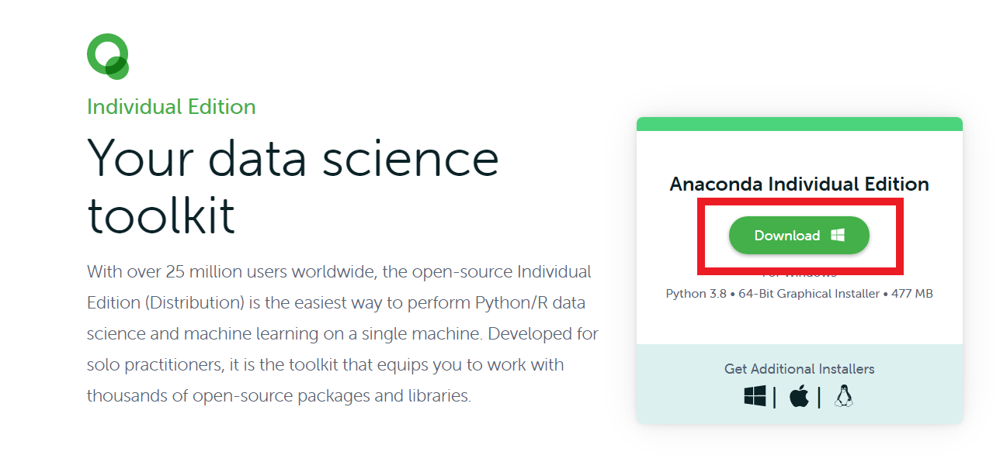

# ---

for 資工系 :
請用 git clone 來下載文件

for 簡單版 ：

1.下載文件

依圖片下載壓縮檔並解壓縮，解完壓縮把它放桌面

2.把所有要合併的csv檔,放進data的資料夾裡
- csv找學長拿嘿

3.這裡windows鍵按下去(不知道那是甚麼的話左下角按搜尋)，打prompt，按Enter。
- ps：如果沒有prompt，要下載anaconda
- 載點：https://www.anaconda.com/products/individual#windows
(這行複製到網址搜尋)
- 點下他(就能安裝拉～讚讚)

4.在prompt裡面打jupyter notebook(注意中間有空格)，按下enter

5.就能點進剛剛下載的資料夾拉
- 桌面請點desktop

6.打開 合併.ipynb

7.點Run 就能執行完成嘞